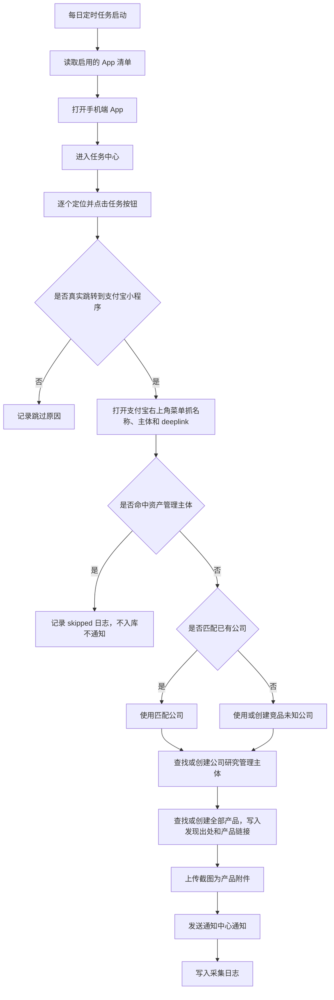

# 手机端任务中心采集入库 PRD

## 1. 背景

目前公司研究模块已经具备公司、管理主体、全部产品、产品附件等基础能力。业务希望每天自动巡检手机端若干竞品 App 的任务中心，识别其中涉及支付宝小程序的任务，并将有效线索沉淀到公司研究中，形成可追踪的竞品产品库和截图证据。

典型待巡检 App 包括：趣头条、中青看点、爱奇艺、河马剧场等。

## 2. 目标

1. 每天自动打开指定 App 清单里的任务中心。
2. 自动筛选任务中心里的支付宝小程序相关任务。
3. 记录小程序名称、公司主体名、来源 App、支付宝小程序 deeplink、采集时间和截图。
4. 写入公司研究前，先检查“资产管理 > 主体管理”：
   - 若主体名称命中资产管理已有主体，跳过入库，不发送通知。
   - 若未命中，再进入公司研究入库流程。
5. 将记录写入公司研究模块：
   - 若能匹配到已有公司，写入对应公司。
   - 若无法匹配，写入“竞品未知公司”。
   - 先维护管理主体，再维护全部产品。
   - 写入或追加产品发现出处。
   - 能抓取到支付宝小程序 deeplink 时写入产品链接，抓不到则留空。
   - 截图作为产品附件上传。
6. 每发现一条需要入库的有效记录，通知中心发送一条通知。
7. 通知支持全部已读和单条已读。

## 3. 非目标

1. 不自动完成任务、刷收益、模拟领取奖励。
2. 不绕过验证码、登录风控、人机校验或 App 安全策略。
3. 不保证所有第三方 App 版本永久兼容，App UI 变化后需要维护采集规则。
4. 第一版不做复杂的公司主体智能归因，只做规则匹配和人工可复核。

## 4. 使用角色

1. 采集管理员：配置手机、App 清单、采集规则和运行计划。
2. 产运部：查看采集到的新产品和截图证据。
3. 商务流量组、商务预算组：关注可投放、可预算分析的小程序任务。
4. CEO、CTO、COO、CMO：查看重要竞品变化通知。

## 5. 功能范围

### 5.1 App 清单配置

需要维护一个手机巡检 App 清单，不建议依赖手机桌面文件夹本身作为唯一配置。

字段建议：

| 字段 | 说明 |
| --- | --- |
| app_name | App 名称，如趣头条 |
| package_name | 安卓包名 |
| task_center_entry | 任务中心入口规则 |
| enabled | 是否启用 |
| sort_order | 执行顺序 |
| remark | 备注 |

采集脚本需要提供配置校验能力。上线或调整 App 规则前，先执行 `npm run mobile-task:validate` 或 `node scripts/mobile-task-center-collector.js --validate-config` 检查 App 名称、包名、入口步骤、按钮规则、支付宝菜单步骤和正则表达式，避免规则错误到实机运行时才暴露。

后台 App 配置页提供“趣头条模板”，用于快速生成趣头条任务中心采集规则。模板只是初始值，入口坐标、支付宝菜单坐标和按钮文案仍需按测试机分辨率与当前 App 版本校准。

### 5.2 手机端自动打开

第一版建议基于安卓设备实现：

1. 通过 ADB 连接测试手机。
2. 按 App 清单逐个打开 App。
3. 进入任务中心页面。
4. 等待页面稳定。
5. 读取任务中心 UI 节点并定位“去完成、去支付宝、立即体验、打开、做任务”等任务按钮。
6. 逐个点击任务按钮，观察是否真实跳转到支付宝；没有跳转到支付宝的任务只记录跳过，不按支付宝小程序入库。
7. 跳转到支付宝小程序后，打开支付宝小程序右上角菜单或详情页，抓取小程序名称、主体名称和页面证据截图。
8. 若支付宝页面未暴露小程序名称，回退解析任务中心卡片文案，例如“打开/体验/试玩 XX 支付宝小程序”，但置信度低于支付宝页面直接识别。
9. 同步尝试捕获打开链路，包括任务按钮触发的系统 Intent、ADB logcat、当前 Activity 参数、WebView URL 或页面文本中出现的支付宝小程序 deeplink。

### 5.3 支付宝小程序识别

命中条件包括但不限于：

1. 点击任务按钮后，当前前台包名或 Activity 确认进入支付宝。
2. 支付宝小程序页面或右上角菜单可抓取到小程序名称。
3. 支付宝小程序菜单、详情页或页面信息可抓取主体名称。
4. 能从系统 Intent、logcat、Activity 参数或页面文本捕获支付宝小程序 deeplink 时，写入产品链接；抓不到不影响产品入库。
5. 对趣头条这类任务中心页面，若小程序名只出现在任务卡片标题或说明中，可用任务卡片文案作为小程序名兜底来源，并在原始载荷中记录 `mini_program_name_capture_method = task_context`。

识别结果字段：

| 字段 | 说明 |
| --- | --- |
| source_app | 来源 App |
| mini_program_name | 支付宝小程序名称 |
| company_entity_name | 公司主体名 |
| task_title | 任务标题 |
| task_description | 任务说明 |
| product_link | 支付宝小程序 deeplink，能抓取则填，抓不到可为空 |
| product_link_capture_method | 链接捕获方式，如 button_intent、activity_intent、logcat、webview_url、alipay_menu_text、manual |
| screenshot_paths | 截图文件 |
| confidence | 采集置信度 |
| collected_at | 采集时间 |

支付宝小程序 deeplink 抓取原则：

1. 优先捕获可直接唤起支付宝小程序的链接，例如 `alipays://platformapi/startapp?...`。
2. 可通过 ADB logcat、系统 Intent、当前 Activity 参数、WebView URL、任务按钮跳转参数或页面文本提取。
3. 支持解析明文 `alipays://` / `alipay://`，也支持日志里常见的 URL 编码链接和 Android `intent://...#Intent;scheme=alipays;...;end` 链接格式。
4. 抓取动作只用于记录链路，不自动完成任务、不领取奖励、不绕过 App 风控。
5. 第三方 App 隐藏、加密或服务端动态生成链路时，允许抓取失败；失败不影响产品入库。
6. 抓取失败时 `product_link` 留空，并在采集日志记录失败原因或捕获方式为空。

### 5.4 公司匹配规则

公司匹配之前必须先执行资产管理主体排除规则。

### 5.4.1 资产管理主体排除规则

若采集到的支付宝小程序产品主体名称命中“资产管理 > 主体管理”里的已有主体，则判定为内部已管理主体，不进入公司研究，不发送通知。

跳过动作：

1. 不创建公司研究公司。
2. 不创建公司研究管理主体。
3. 不创建公司研究全部产品。
4. 不上传截图到公司研究产品附件。
5. 不发送通知中心通知。

建议保留采集日志：

| 字段 | 说明 |
| --- | --- |
| status | skipped |
| skip_reason | 命中资产管理主体，跳过入库 |
| source_app | 来源 App |
| mini_program_name | 小程序名称 |
| company_entity_name | 支付宝小程序菜单或详情页抓到的主体名称 |
| matched_asset_subject_id | 命中的资产管理主体 ID |
| matched_asset_subject_name | 命中的资产管理主体名称 |
| collected_at | 采集时间 |

命中标准：

1. 第一版先做主体名称完全一致。
2. 同时做基础规范化匹配：去除空格、全半角差异、括号差异和常见公司后缀后的名称一致。
3. 第二版再引入模糊匹配和人工复核，避免误跳过。

### 5.4.2 公司研究匹配规则

匹配优先级：

1. 使用识别到的公司主体名匹配公司研究里的管理主体注册名称。
2. 使用公司主体名匹配公司名称或别名。
3. 使用小程序名称匹配已有产品名称。
4. 都无法命中时，归入“竞品未知公司”。

“竞品未知公司”不存在时系统自动创建：

| 字段 | 值 |
| --- | --- |
| 公司名称 | 竞品未知公司 |
| 公司分类 | 竞品公司 |
| 行业 | 待识别 |
| 主营业务 | 手机任务中心采集到的未知主体竞品 |

### 5.5 管理主体入库

写入顺序必须先主体、后产品。

若识别到公司主体名：

1. 在目标公司下查找同名主体。
2. 若不存在，新增管理主体。
3. 主体名称可先使用支付宝小程序菜单或详情页抓取结果。
4. 注册名称同样使用支付宝小程序菜单或详情页抓取结果；若缺失则为空。

若未识别到主体名：

1. 在目标公司下使用“未知主体”或“待识别主体”。
2. 后续人工复核后可调整主体。

### 5.6 产品入库

在目标公司和目标主体下创建或更新产品。

建议字段映射：

| 公司产品字段 | 采集来源 |
| --- | --- |
| 产品名称 | mini_program_name |
| 产品类型 | 支付宝小程序 |
| 状态 | 运营中 |
| 上线时间 | 可为空 |
| 产品描述 | task_description |
| 目标用户 | 可为空或按任务内容提取 |
| 核心功能 | 可为空或按任务内容提取 |
| 产品链接 | product_link，支付宝小程序 deeplink，能抓取则写入 |
| 产品发现出处 | source_app，表示在哪个外部 App 发现该产品 |
| 备注 | 来源 App、任务标题、采集时间、采集置信度 |
| 所属主体 | 管理主体 ID |

去重规则：

1. 同一公司、同一主体、同一产品名称，不重复创建。
2. 已存在产品时更新备注或追加采集记录。
3. 截图可作为附件追加上传。
4. 产品发现出处按来源 App 追加并去重，不覆盖历史来源。
5. 产品链接为空且本次抓到 deeplink 时，补写产品链接。
6. 产品链接已有值且本次抓到不同 deeplink 时，默认不自动覆盖，记录到采集日志或备注，交由人工复核。
7. 本次未抓到 deeplink 时，不用空值覆盖已有产品链接。

产品发现出处追加规则：

1. 新产品首次入库时，`discovery_source = source_app`，如 `趣头条`。
2. 同一产品后续在新来源 App 被发现时，追加来源，如 `趣头条，中青看点，蚂蚁看点`。
3. 同一来源 App 重复采集时只保留一个来源名称。
4. 来源名称写入前先做基础规范化：去除首尾空格、统一中文逗号分隔、过滤空值。
5. 第一版可用文本字段保存，后续如需要统计每个来源的首次发现时间，再拆成产品发现来源明细表。

### 5.7 截图附件上传

每条需要入库的有效记录至少保留一张截图。

命中资产管理主体并被判定为 skipped 的记录，只保留采集日志截图或失败证据截图，不上传到公司研究产品附件。

附件上传位置：

公司研究 > 全部产品 > 对应产品 > 附件

附件命名建议：

`来源App_小程序名_YYYYMMDD_HHmmss.png`

每次采集运行还需要在本地输出一份 `run_report` JSON，记录每个被点击任务按钮的标题、按钮文案、是否跳转支付宝、当前包名、截图路径、API 入库结果和失败原因。未跳转支付宝的按钮默认只进入本地报告，不进入公司研究；如配置 `capture_skipped_screenshots`，可额外保存跳过截图便于排查 UI 规则。

### 5.8 通知中心

每发现一条需要入库的有效记录，发送一条通知。命中资产管理主体并被跳过的记录不发送通知。

通知标题：

`发现支付宝小程序任务：{小程序名称}`

通知内容：

`来源App：{来源App}；公司：{公司名称}；主体：{主体名称}；截图：{截图数量}张；已记录到公司研究全部产品。`

通知链接：

第一版跳转到公司研究页面；后续可优化为跳转到具体公司或具体产品。

通知范围：

1. 产运部所有用户。
2. 产运部下所有小组成员。
3. 商务部里的“商务流量组”成员。
4. 商务部里的“商务预算组”成员。
5. CEO、CTO、COO、CMO。

通知阅读能力：

1. 通知中心支持“全部已读”。
2. 通知列表支持单条点击或单条勾选已读。
3. 通知未读数自动刷新。

## 6. 采集流程



## 7. 后台接口建议

### 7.1 采集记录入库接口

后续可新增统一接口：

`POST /api/mobile-task-center/records`

请求体：

```json
{
  "source_app": "趣头条",
  "mini_program_name": "示例小程序",
  "company_entity_name": "示例主体有限公司",
  "task_title": "支付宝小程序试玩",
  "task_description": "打开支付宝小程序体验任务",
  "product_link": "alipays://platformapi/startapp?appId=2021000000000000",
  "product_link_capture_method": "button_intent",
  "screenshot_attachment_ids": [1, 2],
  "confidence": 0.86,
  "collected_at": "2026-05-22 10:00:00"
}
```

接口职责：

1. 先检查是否命中“资产管理 > 主体管理”。
2. 命中资产管理主体时，记录 skipped 日志并直接返回，不入库、不发通知。
3. 未命中时匹配公司。
4. 创建未知公司。
5. 创建或匹配公司研究主体。
6. 创建或更新产品。
7. 写入或追加产品发现出处。
8. 写入产品链接；抓不到链接时允许为空，且不得用空值覆盖已有链接。
9. 绑定截图附件。
10. 发送通知。
11. 返回公司、主体、产品 ID。

### 7.2 产品通知接口

若前置流程已经完成产品入库，可直接调用产品通知接口：

`POST /api/company_products/:id/task-center-notification`

请求体：

```json
{
  "source_app": "趣头条",
  "mini_program_name": "示例小程序",
  "company_name": "示例公司",
  "entity_name": "示例主体有限公司",
  "product_link": "alipays://platformapi/startapp?appId=2021000000000000",
  "screenshot_count": 2
}
```

## 8. 数据表建议

### 8.1 mobile_task_apps

用于配置采集 App。

| 字段 | 类型 | 说明 |
| --- | --- | --- |
| id | INTEGER | 主键 |
| app_name | TEXT | App 名称 |
| package_name | TEXT | 安卓包名 |
| task_center_entry | TEXT | 任务中心入口规则 |
| enabled | INTEGER | 是否启用 |
| sort_order | INTEGER | 排序 |
| remark | TEXT | 备注 |

### 8.2 mobile_task_records

用于记录每次采集结果。

| 字段 | 类型 | 说明 |
| --- | --- | --- |
| id | INTEGER | 主键 |
| source_app | TEXT | 来源 App |
| mini_program_name | TEXT | 小程序名称 |
| company_entity_name | TEXT | 主体名称 |
| product_link | TEXT | 本次抓取到的支付宝小程序 deeplink，可为空 |
| product_link_capture_method | TEXT | 链接捕获方式 |
| matched_asset_subject_id | INTEGER | 命中的资产管理主体 ID |
| matched_asset_subject_name | TEXT | 命中的资产管理主体名称 |
| company_id | INTEGER | 匹配公司 |
| entity_id | INTEGER | 匹配主体 |
| product_id | INTEGER | 匹配产品 |
| task_title | TEXT | 任务标题 |
| task_description | TEXT | 任务描述 |
| confidence | REAL | 采集置信度 |
| status | TEXT | matched / unknown / skipped / failed |
| skip_reason | TEXT | 跳过原因 |
| error_message | TEXT | 失败原因 |
| review_status | TEXT | none / pending / reviewed |
| review_note | TEXT | 人工复核备注 |
| reviewed_by | INTEGER | 复核人 |
| reviewed_at | DATETIME | 复核时间 |
| raw_payload | TEXT | 原始采集载荷，保留小程序名捕获方式、前台包名、Activity 和 observed_focus 等诊断信息 |
| collected_at | DATETIME | 采集时间 |
| created_at | DATETIME | 创建时间 |

### 8.3 company_products 字段

公司研究的全部产品需要保存采集沉淀字段：

| 字段 | 类型 | 说明 |
| --- | --- | --- |
| product_link | TEXT | 产品链接，支付宝小程序场景保存 deeplink |
| discovery_source | TEXT | 产品发现出处，多个来源 App 用中文逗号分隔并去重 |

字段写入规则：

1. 新增产品时直接写入本次 `source_app` 和本次抓到的 `product_link`。
2. 更新已有产品时追加 `discovery_source`，但不重复追加同一个来源 App。
3. 已有 `product_link` 为空时，允许用本次抓到的 deeplink 补齐。
4. 已有 `product_link` 非空时，本次抓到的新链接不自动覆盖，记录到 `mobile_task_records` 供复核。
5. 本次 `product_link` 为空时，不覆盖已有产品链接。

## 9. 异常处理

| 场景 | 处理方式 |
| --- | --- |
| App 未登录 | 截图记录失败原因，通知采集管理员 |
| App 弹窗遮挡 | 尝试关闭一次，仍失败则记录 |
| 未抓到小程序名 | 记录为待复核，不创建产品 |
| 主体命中资产管理主体 | 记录 skipped 日志，不入库，不上传公司研究附件，不发通知 |
| 未识别主体 | 归入“待识别主体” |
| 未匹配公司 | 归入“竞品未知公司” |
| 未抓到支付宝小程序 deeplink | 产品正常入库，产品链接留空，采集日志记录未捕获 |
| 已有产品链接与本次抓取链接不一致 | 不自动覆盖已有链接，记录差异供人工复核 |
| 上传截图失败 | 产品仍可入库，记录失败日志 |
| 通知发送失败 | 不影响产品入库，记录错误 |
| 支付宝页面未暴露小程序名但任务卡片可识别 | 使用任务卡片文案兜底入库，降低置信度并保留原始载荷供复核 |

后台采集日志需要支持按复核状态筛选，并允许管理员将待复核记录标记为已复核或重新标记为待复核。当前列表支持导出 CSV，便于离线检查采集失败、链接冲突和新来源追加情况。

## 10. 权限与风控

1. 采集设备只使用测试账号，不使用个人账号。
2. 自动化只做查看、截图和记录，不做任务完成动作。
3. 截图可能包含第三方 App 页面内容，需按内部资料处理。
4. 通知范围限定为产运、指定商务小组和高管。
5. 后台接口需要登录态或内部服务 Token，避免外部滥用。

## 11. 分期计划

### 第一期：最小可用版本

1. 配置 1 台安卓测试机。
2. 接入 2 个 App。
3. 实现任务中心打开、任务按钮遍历、跳转验证和截图。
4. 跳转到支付宝小程序后，从右上角菜单或详情页抓取小程序名和主体名。
5. 支持趣头条任务卡片文案兜底识别小程序名，例如“体验 XX 支付宝小程序”。
6. 先检查资产管理主体，命中则跳过。
7. 未命中时写入“竞品未知公司”或已存在公司。
8. 写入产品发现出处，支持同一产品多来源追加去重。
9. 尝试捕获并写入支付宝小程序 deeplink，抓不到则留空。
10. 上传截图到全部产品附件。
11. 发送通知中心通知。

### 第二期：提高稳定性

1. 增加 App 规则配置页面。
2. 增加采集日志页面。
3. 增加失败截图、人工复核和日志导出。
4. 增加小程序名和主体名规则库。
5. 增加 deeplink 捕获方式配置和失败原因统计。
6. 支持更多 App。

### 第三期：分析与复盘

1. 按来源 App 统计任务数量。
2. 按公司主体统计小程序分布。
3. 按时间统计新增小程序趋势。
4. 支持导出采集报告。

## 12. 验收标准

1. 每天可按计划完成启用 App 的巡检。
2. 命中支付宝小程序任务后，能在公司研究中找到对应产品。
3. 若主体名称命中资产管理主体，则不在公司研究创建公司、主体、产品或附件，也不发送通知。
4. 未命中资产管理主体的产品归属到正确公司和管理主体；无法识别时进入“竞品未知公司”。
5. 截图能在产品附件里查看或下载。
6. 新产品首次入库时，产品发现出处写入当前来源 App，如 `趣头条`。
7. 同一产品在中青看点、蚂蚁看点等新来源再次被发现时，不新增重复产品，原产品发现出处追加为多个来源并去重。
8. 同一来源 App 重复采集时，不重复追加来源名称。
9. 能抓到支付宝小程序 deeplink 时，产品链接写入全部产品的产品链接字段。
10. 抓不到 deeplink 时，产品仍正常入库，产品链接留空，并记录采集日志。
11. 已有产品链接不被空值覆盖；抓到不同链接时不自动覆盖，保留复核记录。
12. 每条需要入库的有效记录会产生通知。
13. 产运部、商务流量组、商务预算组、CEO、CTO、COO、CMO 可收到通知。
14. 通知中心支持全部已读和单条已读。
